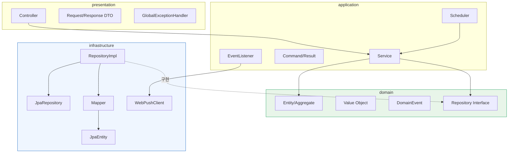
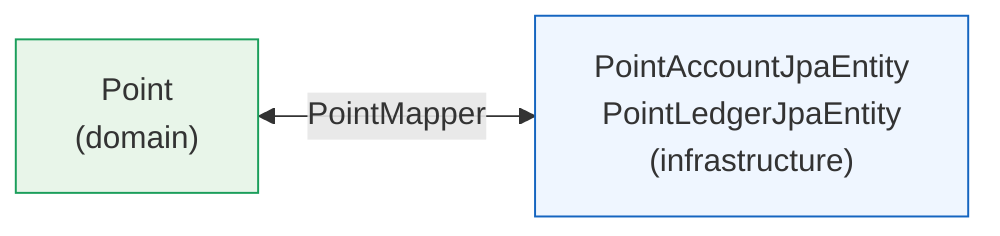
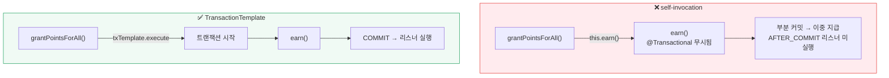
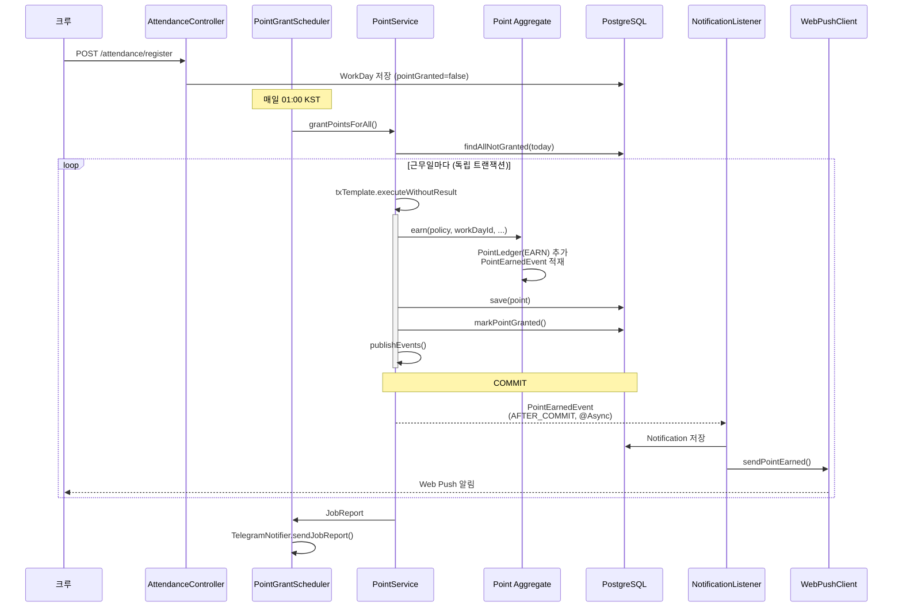
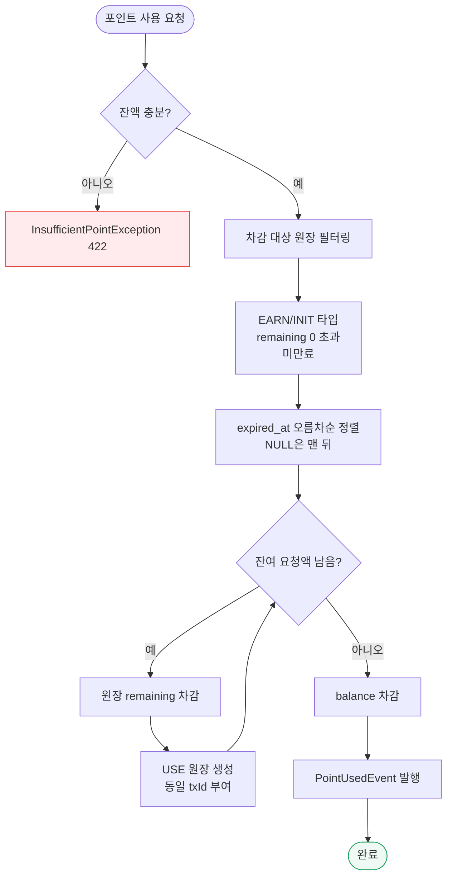
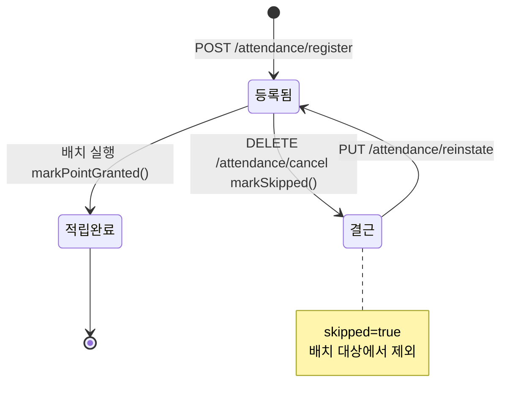
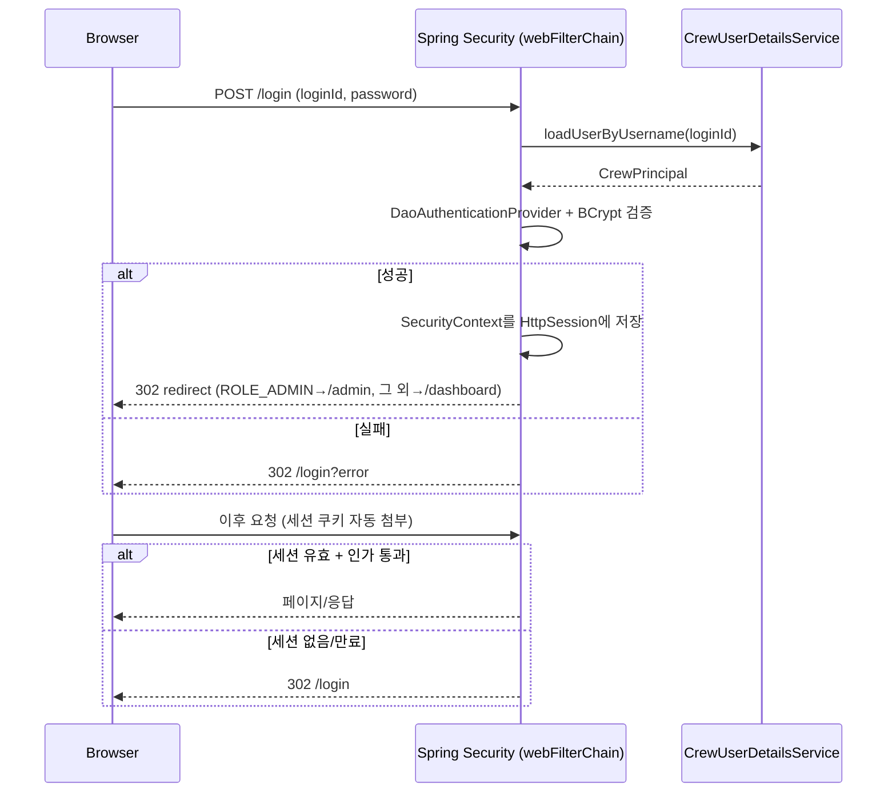

# Architecture

CrewCheck 백엔드의 레이어 구조, 도메인 이벤트 흐름, 트랜잭션 전략을 정의한다.

> 서비스명은 CrewCheck이나 코드상 식별자는 이전 명칭(MATE)을 유지한다.
> 패키지 `com.oliveyoung.mate`, `MateApplication` 등은 리네임하지 않는다.

---

## 1. 레이어 구조

```
com.oliveyoung.mate
├── presentation      HTTP 경계
├── application       유스케이스 조합
├── domain            핵심 비즈니스 규칙 (프레임워크 의존 없음)
└── infrastructure    기술 구현체
```



### 의존 규칙

- `domain`은 **아무것도 의존하지 않는다.** Spring·JPA 어노테이션이 들어가면 안 된다.
- `infrastructure`가 `domain`의 Repository 인터페이스를 구현한다 (의존성 역전).
- `presentation`은 `application`만 호출한다. Repository를 직접 부르지 않는다.

### 레이어별 책임

| 레이어 | 포함 | 예시 |
|---|---|---|
| `presentation` | Controller, Request/Response DTO, ExceptionHandler, SecurityConfig | `PointController`, `UsePointRequest`, `GlobalExceptionHandler` |
| `application` | Service, Command/Result, Scheduler, EventListener | `PointService`, `UsePointCommand`, `PointGrantScheduler` |
| `domain` | Entity, VO, DomainEvent, Repository 인터페이스, 도메인 예외 | `Point`, `Money`, `PointEarnedEvent`, `PointRepository` |
| `infrastructure` | JpaEntity, JpaRepository, Mapper, RepositoryImpl, 외부 API 클라이언트 | `PointLedgerJpaEntity`, `PointMapper`, `WebPushClient` |

### 패키지 구조 (도메인별 수직 분할)

각 레이어 안에서 다시 도메인(`point`, `attendance`, `crew`, `schedule`, `notification`)으로 나눈다.

```
application/point/PointService.java
domain/point/model/Point.java
infrastructure/point/persistence/PointRepositoryImpl.java
presentation/point/PointController.java
```

---

## 2. 도메인 모델과 영속성 분리

`domain` 모델과 JPA 엔티티는 **별도 클래스**이며, `Mapper`가 변환한다.



### 왜 분리하는가

- `domain.Point`는 Hibernate를 몰라도 되는 순수 객체 → DB·ORM 교체 시에도 비즈니스 규칙이 살아남는다.
- JPA의 제약(기본 생성자 필요, 프록시, 지연 로딩)이 도메인 설계를 오염시키지 않는다.

### 생성 vs 복원

```java
// 신규 생성 — 비즈니스 의도가 담긴 이름
Point.create(crewId)
Notification.pointEarned(crewId, amount, grantedAt)

// DB 복원 전용 — id, 상태값을 DB 값 그대로 되살림
PointLedger.reconstruct(ledgerId, crewId, ..., remaining, ...)
Notification.reconstruct(id, crewId, ..., read, sentAt)
```

**주의**: 복원 시 `reconstruct()`를 쓰지 않으면 `ledgerId`가 새로 생성되거나 `remaining`이 초기값으로 덮어써져 데이터가 깨진다.

### 변경 추적 (Point 애그리거트)

`Point`는 저장 시 최소 쿼리만 날리기 위해 변경분을 스스로 추적한다.

```java
private final List<PointLedger> newLedgers;      // 신규 원장 → batch INSERT
private final Set<UUID> dirtyLedgerIds;          // remaining 변경분 → targeted UPDATE
```

`PointRepositoryImpl.save()`가 이를 읽어 `saveAll()` / `updateRemaining()`을 구분 실행한다.

### 레이어 두께 조절

모든 도메인에 같은 두께를 적용하지 않는다.

| 도메인 | 구조 | 이유 |
|---|---|---|
| `Point`, `PointLedger` | 도메인 모델 + Mapper + 이벤트 (풀 스택) | 금전 로직, 규칙 복잡, 정확성 최우선 |
| `Notification`, `PushSubscription` | 도메인 모델 + Mapper (이벤트 없음) | 단순 CRUD에 가까움 |

---

## 3. 도메인 이벤트

### 이벤트는 애그리거트가 생성한다

```java
public class Point {
    private final List<Object> domainEvents = new ArrayList<>();

    public void earn(PointPolicy policy, UUID workDayId, LocalDateTime grantedAt, LocalDateTime expiredAt) {
        // ... 적립 로직 ...
        domainEvents.add(new PointEarnedEvent(crewId, earnAmount, grantedAt, expiredAt));
    }

    public List<Object> pullDomainEvents() {
        List<Object> events = new ArrayList<>(domainEvents);
        domainEvents.clear();   // 중복 발행 방지
        return events;
    }
}
```

**왜 Service가 아닌 도메인 객체가 만드는가**
"포인트가 적립되면 이벤트가 발생한다"는 비즈니스 규칙이다. Service에 두면 새 메서드가 추가될 때마다 사람이 이벤트 발행을 기억해야 하지만, `Point.earn()` 안에 두면 이를 호출하는 모든 경로가 자동으로 이벤트를 남긴다.

### Service는 발행만 담당

```java
private void publishEvents(Point point) {
    point.pullDomainEvents().forEach(eventPublisher::publishEvent);
}
```

### 이벤트 목록

| 이벤트 | 발생 시점 | 필드 |
|---|---|---|
| `PointEarnedEvent` | `Point.earn()` | `crewId`, `amount`, `grantedAt`, `expiredAt` |
| `PointUsedEvent` | `Point.use()` | `crewId`, `amount`, `usedAt` |
| `PointExpiredEvent` | `Point.expireOld()` | `crewId`, `amount`, `expiredAt` |
| `WorkDayRegisteredEvent` | 근무일 등록 | — |

---

## 4. 트랜잭션 전략

### 4-1. self-invocation 함정 (최우선 주의사항)

Spring의 `@Transactional`은 **AOP 프록시**로 동작한다. 같은 클래스 내부에서 호출하면 프록시를 우회하므로 어노테이션이 무시된다.



```java
// ❌ 잘못된 예 — this.earn()이므로 트랜잭션 없이 실행됨
public JobReport grantPointsForAll() {
    workDays.forEach(wd -> earn(new EarnPointCommand(...)));
}

// ✅ 올바른 예 — TransactionTemplate으로 명시적 경계 생성
public JobReport grantPointsForAll() {
    workDays.forEach(wd -> {
        EarnPointCommand cmd = new EarnPointCommand(...);
        txTemplate.executeWithoutResult(status -> earn(cmd));
    });
}
```

**트랜잭션이 없으면 발생하는 문제**

1. `pointRepository.save()`와 `workDayRepository.markPointGranted()`가 원자적으로 묶이지 않음 → 부분 커밋 시 다음날 재적립(**이중 지급**)
2. `@TransactionalEventListener(AFTER_COMMIT)` 리스너가 **조용히 실행되지 않음** → 알림 유실. 에러가 나지 않아 발견이 매우 어렵다.

### 4-2. 배치는 항목별 독립 트랜잭션

```java
workDayRepository.findAllNotGranted(today).forEach(workDay -> {
    try {
        txTemplate.executeWithoutResult(status -> earn(cmd));
        count[0]++;
    } catch (Exception e) {
        count[1]++;
        log.error("[Admin Cron] 포인트 지급 실패. crewId={}", workDay.getCrewId(), e);
    }
});
```

한 크루의 실패가 전체 배치를 롤백시키지 않도록 항목 단위로 트랜잭션을 열고, 실패는 카운트만 하고 계속 진행한다. 결과는 `JobReport`로 집계해 Telegram으로 발송한다.

### 4-3. 스케줄러 예외 처리

스케줄러 스레드의 예외는 `@RestControllerAdvice`(`GlobalExceptionHandler`)가 잡지 못한다. 스케줄러 내부에서 직접 try-catch 후 알린다.

```java
@Scheduled(cron = "0 0 1 * * *", zone = "Asia/Seoul")
public void grantPoints() {
    try {
        telegramNotifier.sendJobReport(pointService.grantPointsForAll());
    } catch (Exception e) {
        log.error("[Admin Cron] 포인트 적립 스케줄러 실패", e);
        telegramNotifier.sendSchedulerError("포인트 적립 (PointGrantScheduler)", e);
    }
}
```

### 4-4. 낙관적 락

`point_account`에 `@Version` 필드가 있어, 동시에 같은 크루의 포인트를 사용하려 하면 나중 트랜잭션이 `OptimisticLockingFailureException`으로 실패한다. **잔액 음수 방지의 실질적 방어선**이다.

프론트는 사용 버튼 `disabled` 처리를 병행해 중복 요청을 줄인다.

---

## 5. 비동기 부수효과 (알림)

### AFTER_COMMIT 리스너

```java
@Async
@TransactionalEventListener(phase = TransactionPhase.AFTER_COMMIT)
public void onPointEarned(PointEarnedEvent event) {
    Notification notification = Notification.pointEarned(event.crewId(), event.amount(), event.grantedAt().toLocalDate());
    notificationRepository.save(notification);
    webPushClient.sendPointEarned(event.crewId(), event.amount(), grantedDate);
}
```

**왜 AFTER_COMMIT인가**

```
[@EventListener]  적립 저장 → 알림 발송 → 롤백  ⇒ 포인트는 없는데 알림만 나감
[AFTER_COMMIT]    적립 저장 → 커밋 → 알림 발송   ⇒ 실제 저장된 것만 알림
```

### @Async 전제 조건

- `MateApplication`에 `@EnableAsync` 필요. 없으면 **조용히 동기 실행**된다 (컴파일 에러 없음).
- 기본 `SimpleAsyncTaskExecutor`는 호출마다 새 스레드를 만들므로, `AsyncConfig`에서 `taskExecutor` 빈으로 `ThreadPoolTaskExecutor`를 등록해 사용한다.

---

## 6. 파이프라인

### 6-1. 포인트 적립



### 6-2. FIFO 차감



### 6-3. 포인트 만료

```
[배치] PointExpiryScheduler → expireAllPoints()
    ↓ findAllCrewIdsWithExpiringPoints()
    ↓ txTemplate → expirePoints(crewId)
    │     └─ Point.expireOld(now)
    │           ├─ 대상 원장 remaining 전액 차감
    │           ├─ PointLedger(EXPIRE) 추가
    │           └─ PointExpiredEvent 발행
    ↓ JobReport → Telegram
```

### 6-4. 근무일 상태 전이



### 6-5. 단계별 실패 처리

| 단계 | 실패 시 |
|---|---|
| 개별 `earn()` | 해당 트랜잭션만 롤백, 배치 계속 |
| 이벤트 리스너 | 커밋된 적립엔 영향 없음, 알림만 유실 |
| Push 발송 | endpoint 단위 try-catch, 만료 구독은 삭제 |
| 스케줄러 전체 | 내부 catch → `sendSchedulerError()` |

---

## 7. 인증 흐름

2026-08-26 최종 컷오버로 JWT(`JwtAuthFilter`/`JwtProvider`) 및 CORS 설정을 전부 제거했다. `SecurityConfig`는 이제 `webFilterChain` 단일 체인만 존재하며, Spring Security 기본 `HttpSession` 기반 폼로그인으로 동작한다.



- 인증된 크루 ID는 `SecurityUtils.authenticatedCrewId()`(UUID) → `CrewId.of(...)`로 변환해 사용.
- 권한 검증은 `SecurityUtils.validateAdmin()` / `validateSelfOrAdmin(crewId)`.
- `/admin/**`은 `hasRole("ADMIN")`으로 선언적 보호, `/api/v1/admin/**`(배치 수동 트리거 3종)만 예외적으로 permitAll + CSRF 무시 — 세션 없이 `X-Admin-Key` 헤더만으로 curl 호출되는 운영 도구이기 때문(`docs/api-spec.md` 참고).
- htmx/fetch로 상태 변경 요청을 보낼 때는 `fragments/layout.html`의 `_csrf`/`_csrf_header` meta 태그 값을 헤더에 실어야 한다 (Spring Security 기본 CSRF 보호가 세션 체인 전체에 적용됨).

---

## 8. 예외 처리 계층

도메인 예외를 던지고 `GlobalExceptionHandler`가 HTTP 상태로 변환한다. 컨트롤러에서 try-catch 하지 않는다.

| 예외 | 상태 | 코드 | Telegram 알림 |
|---|---|---|---|
| `MethodArgumentNotValidException` | 400 | `INVALID_INPUT` | — |
| `IllegalArgumentException` | 400 | `BAD_REQUEST` | — |
| `IllegalStateException` | 409 | `CONFLICT` | — |
| `DataIntegrityViolationException` | 409 | `CONFLICT` | — |
| `AccessDeniedException` | 403 | `ACCESS_DENIED` | — |
| `PointAccountNotFoundException` | 404 | `POINT_ACCOUNT_NOT_FOUND` | — |
| `NoResourceFoundException` | 404 | `NOT_FOUND` | — |
| `InsufficientPointException` | 422 | `INSUFFICIENT_POINT` | — |
| `Exception` (catch-all) | 500 | `INTERNAL_ERROR` | ✅ |

**원칙**: 정상적으로 발생 가능한 충돌(중복 요청 등)을 catch-all로 흘려보내면 Telegram 알림 노이즈가 된다. 구체적 예외 타입을 먼저 잡아 상태 코드·로그 레벨·알림 여부를 분리한다.

> **미해결**: `OptimisticLockingFailureException`이 현재 catch-all(500)로 떨어진다. 사용자에게 "잠시 후 다시 시도해주세요"로 안내하려면 전용 핸들러 추가를 검토할 것.

---

## 9. 설계 원칙 요약

1. **`domain`에 프레임워크를 들이지 않는다.** 순수 자바로 유지한다.
2. **비즈니스 규칙은 도메인 객체 안에 둔다.** Service는 조합만 한다.
3. **금액은 `Money` VO로만 다룬다.** 생성자에서 음수를 차단한다.
4. **`PointLedger`는 append-only 감사 로그다.** `remaining` 외에는 변경하지 않는다.
5. **쓰기 API는 멱등하게 설계한다.** 중복 클릭·재시도는 상시 발생한다.
6. **복잡도는 필요한 곳에만 투자한다.** 단순 CRUD 도메인에 풀 스택 레이어를 강제하지 않는다.